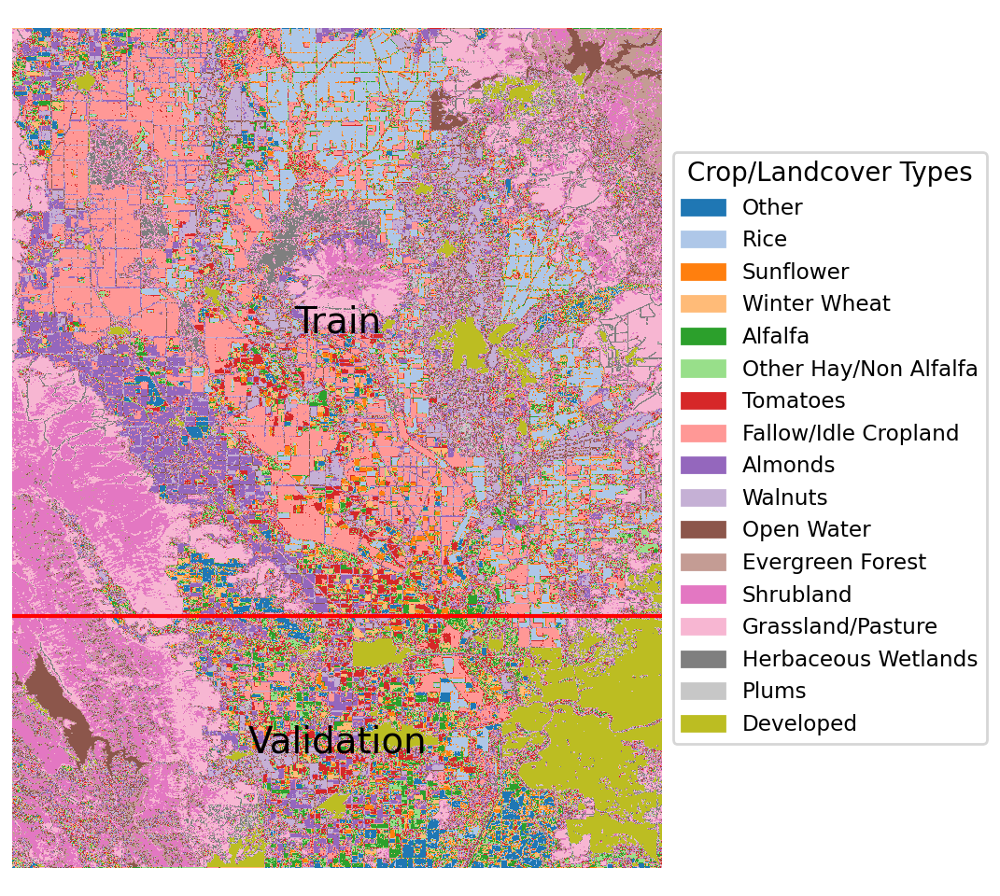

## Crop Type Segmentation with Multi-temporal Landsat Imagery

This project demonstrates the benefits of multi-temporal data for semantic segmentation of satellite imagery for crop type identification. Because of the seasonal patterns present in crop growth, the use of time series can improve crop type classification results. In this project, I use the frozen pretrained encoder from the [Prithvi](https://huggingface.co/ibm-nasa-geospatial/Prithvi-100M) foundation model and train a segmentation head for this task using Landsat 9 imagery (6 bands) as inputs and the Cropland Data Layer (CDL) as labels. The time series are monthly composites from a region in the Sacramento Valley across the growing season (Feb-Sep) for the year 2022.

<div style="text-align: center;">
    
    <p style="text-align: center;">Crop type map and train/val splits for the region used in this project.</p>
</div>

### Container Environment Setup

After cloning this repo, build a Docker image using the included Dockerfile:
```bash
cd crop-type-segmentation
docker build -t crop-type-segmentation:latest .
```

Use the Dev Containers extension in VSCode to open the code in the container (see `.devcontainer` folder).

### Data

Both the Landsat 9 and CDL data can be obtained from Google Earth Engine by running the script [here](https://code.earthengine.google.com/808172f2afcfc353e5f34003aafe6ea4?noload=true).

The data should be placed in `crop-type-segmentation/data`.

#### Data Issues

- Landsat 9 data is missing for this ROI for March 2022, so this month was omitted from the series.
- CDL labels are known to contain noise, which influences model accuracy.

### Training

To train the model, run `train.ipynb`, and test using `test.ipynb`

### Results

The multi-temporal model had a significant performance improvement, as shown below.

Sample results:


Average validation set results:

|                  | Macro F1 | Weighted F1 |
|---------------------------|----------|--------------|
| Mono-temporal             | 0.19     | 0.42         |
| Multi-temporal            | 0.28     | 0.53         |
| % improvement with Multi-temporal | 47%   | 26%          |


Per-class validation set results:

| Class                         | F1 mono-temporal | F1 multi-temporal | % of all pixels |
|-------------------------------|------------------|-------------------|------------------|
| Fallow/Idle Cropland          | 0.33             | 0.37              | 17               |
| Grassland/Pasture             | 0.43             | 0.50              | 12               |
| Shrubland                     | 0.60             | 0.68              | 11               |
| Developed                     | 0.73             | 0.79              | 10               |
| Other                         | 0.10             | 0.14              | 9                |
| Rice                          | 0.23             | 0.74              | 9                |
| Almonds                       | 0.21             | 0.57              | 7                |
| Walnuts                       | 0.27             | 0.54              | 7                |
| Tomatoes                      | 0.34             | 0.69              | 3                |
| Evergreen Forest              | 0.05             | 0.09              | 3                |
| Winter Wheat                  | 0.30             | 0.46              | 2                |
| Alfalfa                       | 0.38             | 0.50              | 2                |
| Other Hay/Non Alfalfa        | 0.02             | 0.02              | 2                |
| Open Water                    | 0.60             | 0.72              | 2                |
| Herbaceous Wetlands           | 0.13             | 0.15              | 2                |
| Sunflower                     | 0.11             | 0.49              | 1                |
| Plums                         | 0.01             | 0.01              | 1                |

